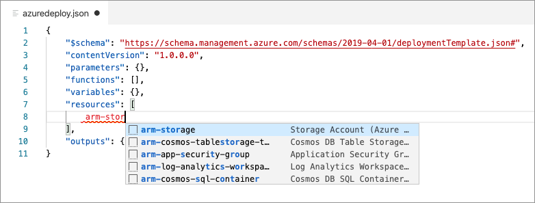
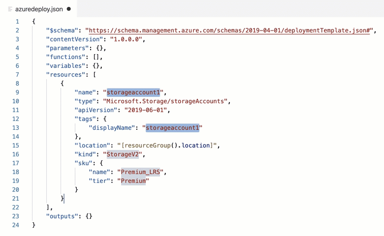
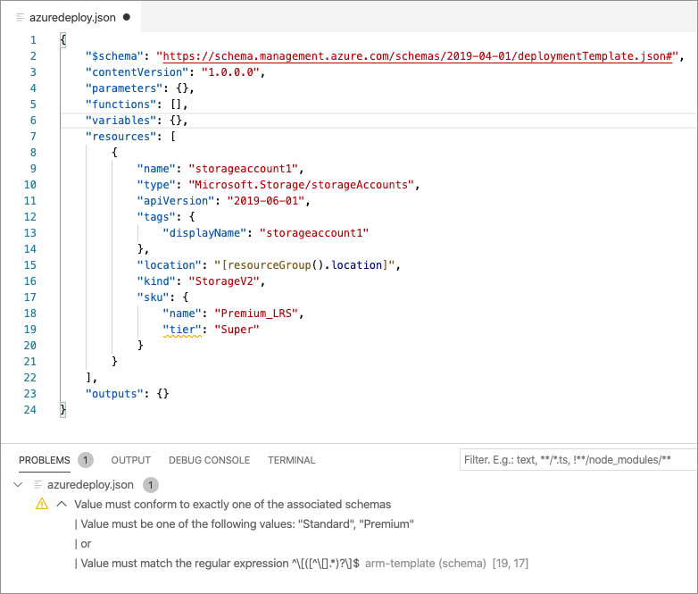
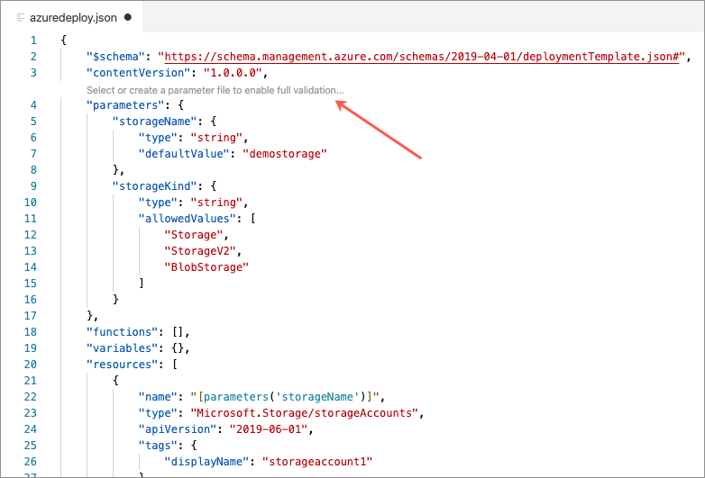
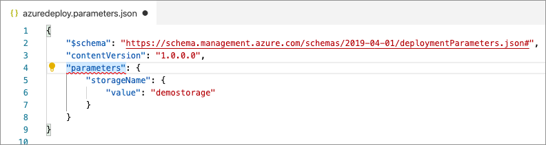
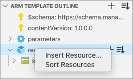

# Azure Resource Manager (ARM) Tools for Visual Studio Code (Preview)

[](https://marketplace.visualstudio.com/items?itemName=msazurermtools.azurerm-vscode-tools) [](https://marketplace.visualstudio.com/items?itemName=msazurermtools.azurerm-vscode-tools) [](https://dev.azure.com/ms-azuretools/AzCode/_build/latest?definitionId=10)

The Azure Resource Manager (ARM) Tools for Visual Studio Code provides language support, resource snippets, and resource auto-completion to help you create and validate Azure Resource Manager templates.

## Getting Started

The following guides detail how to use the ARM Tools extension features.

- [Snippets](#Snippets)
- [Azure schema integration](#Azure-schema-completion-and-validation)
- [Parameter file support](#parameter-files)
- [Completions](#completions)
- [Template navigation](#template-navigation)
- [Other features](#other-features)
- [Extension configuration](#extension-configuration)

## Snippets

Snippets are used to create basic templates and add elements such as parameters, resources, and outputs to existing templates.

### Create a new ARM template

When in an empty JSON file, typing `arm` produces a list of scaffolding snippets. These snippets can be used to create an empty template for any ARM deployment scope (Tenant, Subscription, Management Group, and Resource Group).


Notice that adding scaffolding for an ARM template changes the Visual Studio Code language mode to *Azure Resource Manager Template*.


### Add Azure resource to an ARM template

Once you are working in an ARM template, placing your cursor in the resource and typing `arm`, `CTRL + Space`, or `{` produces a list of 70+ snippets for Azure resources. Selecting a snippet adds an instance of the resource type to the ARM template.



Each snippet includes tab stops to help navigate through commonly modified configurations. Press the `tab` key to navigate to the next stop, and `shift` + `tab` to navigate to the previous stop. As seen in the following example, some stops are pre-populated with a list of common values for quick selection.



### Snippet Reference

The following table lists the available ARM Tools snippets.

| Snippet | Description |
|---|---|
| `arm!` | Adds the framework for a full deployment template file for resource group deployments. |
|`arm!s` | Adds the framework for a full deployment template file for subscription deployments. |
| `arm!mg` | Adds the framework for a full deployment template file for management group deployments. |
| `arm!t` | Adds the framework for a full deployment template file for tenant deployments. |
| `armp!` | Adds the framework for a full deployment template parameters file. |
| `""` | While in the _parameters_ section adds a parameter to the template. |
| `""` | While in the _variables_ section adds a variable to the template. |
| `{}` | While in the _functions_section add a new user-defined function. |
| `arm-` or the resource name | Displays 70+ snippets for creating Azure resources. For example, type `arm-ubuntu` to add all five resources necessary for a basic Ubuntu virtual machine. |
| `""` | While in the _outputs_ section adds an output to the template. |

## Azure schema completion and validation

The ARM Tools extension uses Azure schemas to provide resource completion and validation. These schemas help you verify that Azure resources are configured correctly before deployment time.

### Schema Completions

Entering double quotes `""` or selecting `ctrl` + `space` while the cursor is in a resource declaration provides potential properties and property values for each Azure resource.

In the following example, the potential values for an Azure Storage account tier are returned from the Azure Storage schema.


### Schema Validation

If an invalid property or property value is specified, a validation warning is shown. In the following example, an invalid value has been provided for the storage account tier (line 19). Notice that the warning message includes a list of valid values.



## Parameter files

Associating a parameter file with an ARM template enables full validation across both the parameter file and template. A parameter file association can be made by either creating a new parameter file from an existing template or by associating an existing parameter file to the template.

### Create a new parameter file

To create a new parameter file from an existing template, click on the code lens text `**Select or create a parameter file to enable full validation..**.



Select **New** from the context menu.


Selecting **All parameters** adds every parameter from the template into the new parameter file. Selecting **Only required parameters** adds only parameters that do not have a default value specified in the template file.


Select a name and location for the parameter file.


Once done, a parameter file has been created. Where needed, remove the _TODO_ comment and add a parameter value.


Also, notice that on the template file that the code lens text has been updated to reflect the current parameter file association. This association is also shown on the Visual Studio Code staus bar.


### Associate an existing parameter file

To create an association with an existing parameter file, click on the code lens text `**Select or create a parameter file to enable full validation**'.


If a parameter file with a matching name (template name + "_.parameter_") is found, it can be selected from the list. If a matching file is not found, select **Browse** from the list and then select the parameter file.


### Parameter validation

Once a parameter file has been associated with a template, the extension provides parameter validation across both files. In the following example, a parameter is specified with a set of allowed values. In the parameter file, a value is specified that is not part of the allowed values list. Because of this, the extension produces an error.


### Add missing parameters

To add missing parameters to an existing parameter file, ensure that an association has been created, click somewhere inside "_parameters_", and then click the light bulb icon.



Select the option to add only required or all missing parameters.


Enter a value for the added parameters and also remove the 'TODO' comment.


### Rename a parameter

Right-click on the parameter name and select **Rename Symbol**. This action renames the parameter and all template references to the parameter.


### Remove or update parameter file association

Click on the code lens option for changing a parameter association.


Select a new parameter file or create a new parameter file to update the association. Select **None** to remove the parameter file association.


## Template navigation

The ARM tools extension for VS Code offers several features for navigating around an ARM template.

### ARM template outline

The ARM template outline is used to navigate to and select any element of an ARM template.


In addition to navigation, several features such as insert item and template sorting can be engaged using the buttons found on the ARM template outline.

### Go to Definition

Go to definition can be used to navigate to both parameter and variable definitions. To use go to definition, place your cursor on the parameter or variable name and press `F12` or right-click and select **Go to Definition**.


### Find all references

Right-click on a parameter, variable, or user-defined function name and select **Go to References**. Double-clicking on any reference moves your cursor to the reference location.


## Completions

The ARM Tools extension provides code completions for the following:

  - [Built-in functions such as resourceId and variable](https://go.microsoft.com/fwlink/?LinkID=733958)
  - [Parameter references](https://go.microsoft.com/fwlink/?LinkID=733959)
  - [Variable references](https://go.microsoft.com/fwlink/?LinkID=733960)

## Other features

### Insert Item

In addition to adding snippets from the code editor, the Insert Item feature can be used to insert new parameters, user-defined functions, variables, resources, and outputs. To do so right-click the code editor, select **Insert Item** and follow the on-screen prompts.


You can also right-click on any element in the ARM Template Outline view to initiate the insert item process.



### Sort template

To sort elements of an ARM template alphabetically, right-click on the template and select **Sort Template...**.


Select the element that you want to sort.


Template sorting can also be engaged using the ARM template outline.

### Miscellaneous Features

  - [Signature help](https://code.visualstudio.com/docs/editor/editingevolved#_parameter-hints) for TLE function parameters
  - [Peek](https://code.visualstudio.com/docs/editor/editingevolved#_peek) for variable and parameter definitions
  - Find all references (Shift + F12) for variables and parameters
  - Rename (F2) variables and parameters and their references
  - [Hover](https://code.visualstudio.com/docs/editor/editingevolved#_hover) for parameter description
  - [TLE brace matching](https://code.visualstudio.com/docs/editor/editingevolved#_bracket-matching)
  - User-defined template functions, see Azure [documentation](https://docs.microsoft.com/en-us/azure/azure-resource-manager/resource-group-authoring-templates#functions)
  - Variable iteration ("copy blocks"), see Azure [documentation](https://docs.microsoft.com/en-us/azure/azure-resource-manager/resource-group-create-multiple#variable-iteration)
  - Sort template and template sections alphabetically

## Extension configuration

You may be interested in adjusting the following extension configurations. These can be configured in [VS Code User Settings](https://code.visualstudio.com/docs/getstarted/settings).

| Configuration | Description |
|---|---|
| azureResourceManagerTools.autoDetectJsonTemplates | Auto-detects ARM template and sets editor language type to Azure Resource Manager. |
| azureResourceManagerTools.checkForLatestSchema | Check if the root schema for deployment templates is using an out-of-date version and suggest updating it to the latest version. |
| azureResourceManagerTools.checkForMatchingParameterFiles | Check if an opened template file has a matching params file and prompt to create an association. |
| azureResourceManagerTools.codelens.enable | Set to false to disable all code lens functionality. |
| azureResourceManagerTools.codelens.parameters | Set to false to disable code lens for parameters. |

## Automatic Detection of deployment template files

By default, the extension recognizes a .json or .jsonc file as a deployment template file based on the \$schema specified in the file (for instance, `https://schema.management.azure.com/schemas/2018-05-01/deploymentTemplate.json#`) and will switch the editor language to "Azure Resource Manager Template" automatically. If you do not want that behavior, you can set the `azureResourceManagerTools.autoDetectJsonTemplates` setting to false and use the below methods to determine which files to treat as deployment templates.

Besides automatic detection, you can also use the `files.associations` setting to set up your own specific associations based on specific files paths or patterns to mark them as deployment templates, e.g.

```json
"files.associations": {
    "*.azrm.json": "arm-template" // Treat these files as deployment templates
}
```

## Troubleshooting

Use the following wiki article to help troubleshoot these known issues.

- [Could not find/download: ".NET Core Runtime" with version = 2.2.5](https://github.com/microsoft/vscode-azurearmtools/wiki/Troubleshooting-DotNet-Acquisition)
- [Resource schema warning: "For full schema validation, consider updating the value to one of the following.."](https://github.com/microsoft/vscode-azurearmtools/wiki/Unrecognized-Resource-API-Version)

## Related Links

- [VS Code Azure Resource Manager snippets and cross-platform deployment scripts](https://go.microsoft.com/fwlink/?LinkID=733962)
- [Azure Quickstart Templates](https://go.microsoft.com/fwlink/?LinkID=734038)

## Contributing

There are several ways you can contribute to our [repo](https://github.com/Microsoft/vscode-azurearmtools):

- **Ideas, feature requests, and bugs**: We are open to all ideas and we want to get rid of bugs! Use the [Issues](https://github.com/Microsoft/vscode-azurearmtools/issues) section to report a new issue, provide your ideas or contribute to existing threads.
- **Documentation**: Found a typo or strangely worded sentences? Submit a PR!
- **Snippets**: Have a fix for a snippet or a new snippet idea? File an [Issue](https://github.com/Microsoft/vscode-azurearmtools/issues) or submit a PR!
  - See [our snippets file for ARM templates](https://github.com/microsoft/vscode-azurearmtools/blob/master/assets/armsnippets.jsonc)
- **Code**: Contribute bug fixes, features or design changes:
  - Clone the repository locally and open in VS Code.
  - Install [TSLint for Visual Studio Code](https://marketplace.visualstudio.com/items?itemName=eg2.tslint).
  - Open the terminal (press `CTRL+`\`) and run `npm install`.
  - To build, press `F1` and type in `Tasks: Run Build Task`.
  - Debug: press `F5` to start debugging the extension.

## Legal

Before we can accept your pull request you will need to sign a **Contribution License Agreement**. All you need to do is to submit a pull request, then the PR will get appropriately labeled (e.g. `cla-required`, `cla-norequired`, `cla-signed`, `cla-already-signed`). If you already signed the agreement we will continue with reviewing the PR, otherwise, the system will tell you how you can sign the CLA. Once you sign the CLA all future PR's will be labeled as `cla-signed`.

## Code of Conduct

This project has adopted the [Microsoft Open Source Code of Conduct](https://opensource.microsoft.com/codeofconduct/). For more information see the [Code of Conduct FAQ](https://opensource.microsoft.com/codeofconduct/faq/) or contact [opencode@microsoft.com](mailto:opencode@microsoft.com) with any additional questions or comments.

## Telemetry

VS Code collects usage data and sends it to Microsoft to help improve our products and services. Read our [privacy statement](https://go.microsoft.com/fwlink/?LinkID=528096&clcid=0x409) to learn more. If you don’t wish to send usage data to Microsoft, you can set the `telemetry.enableTelemetry` setting to `false`. Learn more in our [FAQ](https://code.visualstudio.com/docs/supporting/faq#_how-to-disable-telemetry-reporting).

## License

The source code in our [public repository](https://github.com/Microsoft/vscode-azurearmtools) is licensed under the [MIT license](LICENSE.md) and may be locally built and used in accordance with this license.

When the extension is [published](https://marketplace.visualstudio.com/items?itemName=msazurermtools.azurerm-vscode-tools) to the VS Code Marketplace, it is bundled with the Azure Resource Manager language service binaries. The extension as bundled and published this way is licensed under a traditional Microsoft product license.
